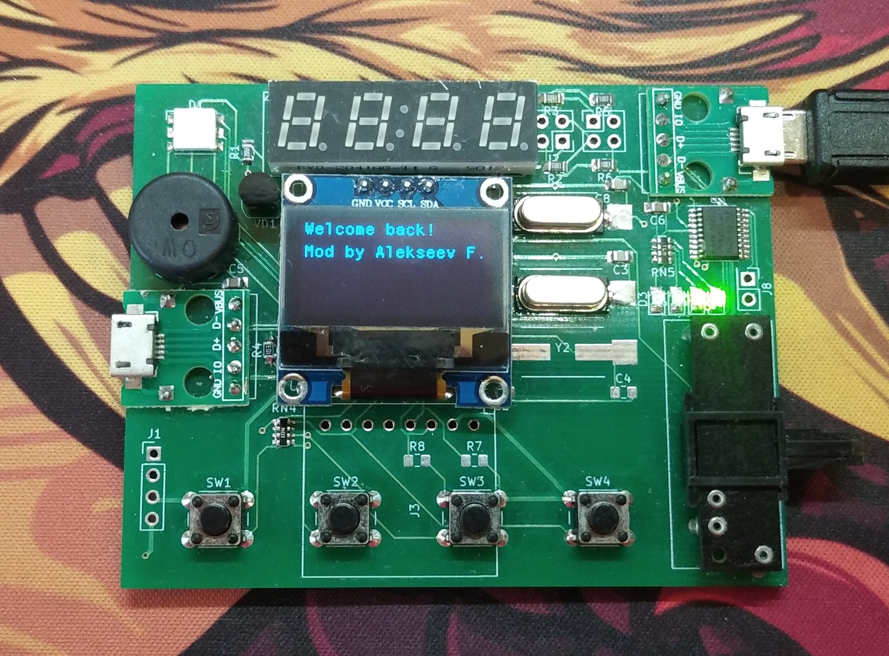

# Spaceshield

Комплект проектов для платы «космошилд» (STM32), которые разработаны мной в рамках курса «Системное ПО»

## Описание структуры репозитория

|Директория|Описание|
|----------|--------|
|FlappyBird|Игра «Flappy bird»|
|Graphs|Редактор математический графиков|
|libSpaceshieldVS|Разработанный шаблон, который лежит в основе проектов этого репозитория|
|Snake|Игра «Змейка»|
|SpaceshieldROM|Модифицированная прошивка для «космошилд»|
|Tamagotchi|Игра «Тамагочи»|
|Tetris|Игра «Тетрис»|
|TicTacToe|Игра «Крестики-нолики»|

## Проекты на YouTube

Мне удалось запустить клип «Bad Apple!!» на данной плате: [ссылка на видео](https://www.youtube.com/watch?v=Y6wT4byfmEU)

Также получилось транслировать изображение игры «DOOM» на дисплей: [ссылка на видео](https://www.youtube.com/watch?v=tq8J4_eNUeI)